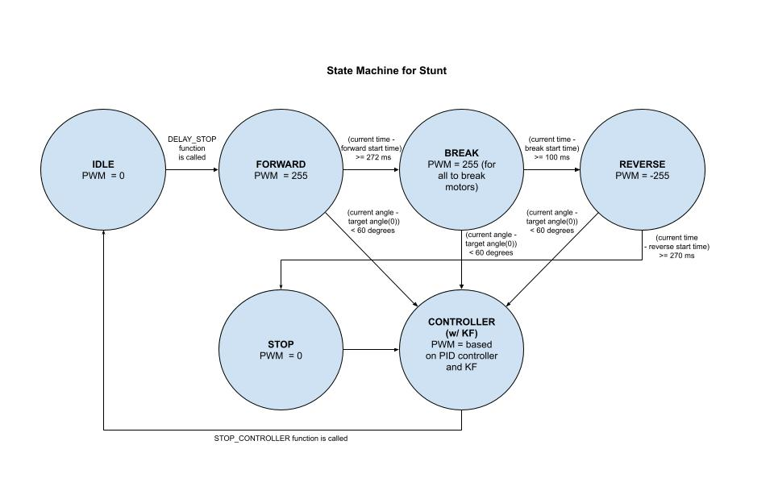
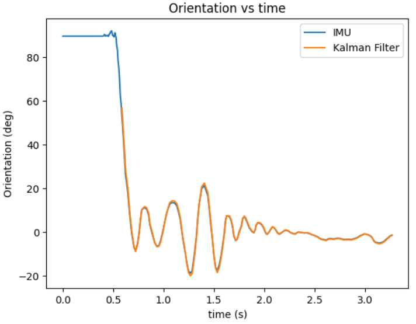
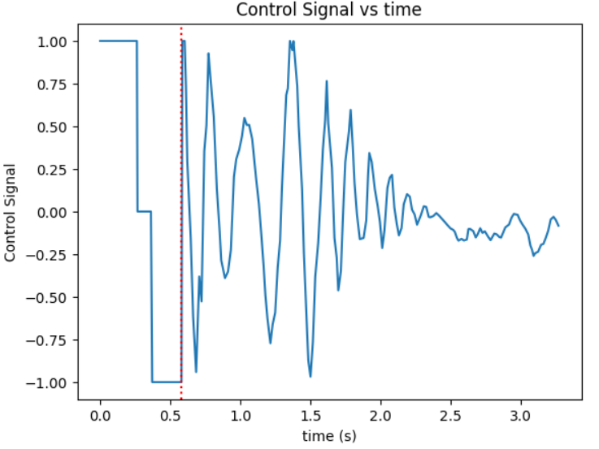
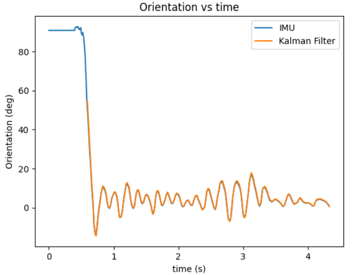
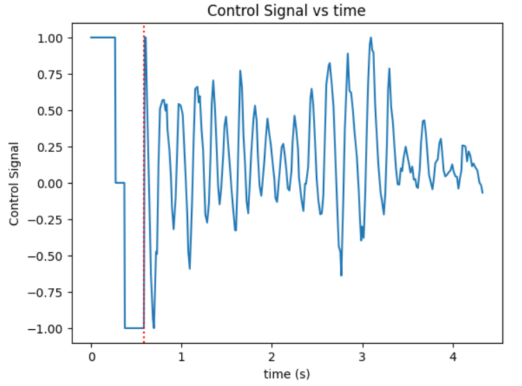

Lab 12: Self-Flippable Inverted Pendulum Car
====================================

.. contents::
   :local:
   :depth: 2

Introduction
------------

When figuring out what to do for the final project. My dear classmate, Anunth Ramaswami, implemented a controller inspired by Stephen Wagner's work the previous year. My original idea was to do the same and then get our cars to balance on top of each other, but my car would not cooperate, so we pivoted so that I would figure out how to make the car flip into the stunt. You can read  more about it below, but I essentially did this by implementing a state machine, and running trials to see the balance of how it could get into flip position. Then my classmate Aravind Ramaswami implemented a Kalman filter.

Our project was to take  on the challenge of developing a car that not only balances like an inverted pendulum but also flips up autonomously from a horizontal position to achieve that balance. This required integrating nonlinear system modeling, control theory, real-time estimation, and embedded systems engineering into one complete design. Together we had a blast.

Approach
--------

To achieve this behavior, we implemented the following steps:

1. **System Modeling**: Derive nonlinear equations using Lagrangian mechanics and linearize about an equilibrium point.
2. **Kalman Filtering**: Construct a discrete-time observer for estimating the system state.
3. **State-Space Control**: Use pole placement for state feedback stabilization.
4. **Flip Code**: Implement commands to physically flip the robot up.
5. **State Machine Integration**: Combine all components to operate in sync at the correct moments.

Realistically, the actual order was Anunth making the controller, I integrating the state machine so it could go into a wheelie , and then Aravind doing the math so he could implement a Kalman Filter for this system.

State Machine Model
-------------------

We model our inverted RC car as a wheel of mass :math:`M` with an attached rigid rod (chassis) of mass :math:`m` and length :math:`l`. The wheel can roll horizontally without slipping, and the rod pivots about the wheel axle. We choose the generalized coordinates:

.. math::
   :nowrap:

   {q}= \begin{bmatrix} x \\ \theta \end{bmatrix},
   \quad
   {x}= \text{horizontal axle position},
   \quad
   \theta = \text{pendulum angle from vertical (CCW positive)}.

The full state vector, including velocities, is:

.. math::
   :nowrap:

   x = \begin{bmatrix} x & \dot{x} & \theta & \dot{\theta} \end{bmatrix}^T,
   \quad
   u = \tau,

where :math:`\tau` is the torque applied by the motor to the wheel.

Geometry and Velocities
^^^^^^^^^^^^^^^^^^^^^^^

The rod’s center of mass lies at:

.. math::

   x_{\mathrm{rod}} = x + l \sin\theta,  \\
   y_{\mathrm{rod}} = -\,l \cos\theta.

Differentiating, its linear velocities are:

.. math::

   \dot{x}_{\mathrm{rod}} = \dot{x} + l \cos\theta\,\dot{\theta},  \\
   \dot{y}_{\mathrm{rod}} = l \sin\theta\,\dot{\theta}.

Kinetic and Potential Energy
^^^^^^^^^^^^^^^^^^^^^^^^^^^^

The total kinetic energy :math:`T` is:

.. math::
   :nowrap:

   T = \tfrac12 M \dot{x}^2
     + \tfrac12 m \bigl(\dot{x}_{\mathrm{rod}}^2 + \dot{y}_{\mathrm{rod}}^2\bigr)
     + \tfrac12 I \dot{\theta}^2.

Expanding:

.. math::

   T = \tfrac12 (M + m)\dot{x}^2
     + m\,l \cos\theta\,\dot{x}\,\dot{\theta}
     + \tfrac12 (m\,l^2 + I)\dot{\theta}^2.

The potential energy :math:`V` (measured from upright) is:

.. math::

   V = -\,m g l \cos\theta.

Equations of Motion
^^^^^^^^^^^^^^^^^^^^

Define the Lagrangian :math:`\mathcal{L} = T - V`, and apply Euler–Lagrange:

.. math::

   \frac{d}{dt}\Bigl(\frac{\partial \mathcal{L}}{\partial \dot{q}_i}\Bigr)
   - \frac{\partial \mathcal{L}}{\partial q_i}
   = Q_i,

with :math:`Q_x = \tau/r` and :math:`Q_\theta = 0`. The resulting nonlinear equations are:

.. math::

   (M + m)\,\ddot{x} + m\,l\cos\theta\,\ddot{\theta}
     - m\,l\sin\theta\,\dot{\theta}^2 = \frac{\tau}{r},  \\
   (m\,l^2 + I)\,\ddot{\theta} + m\,l\cos\theta\,\ddot{x}
     = m\,g\,l\,\sin\theta.

Linearization About Upright
^^^^^^^^^^^^^^^^^^^^^^^^^^^^

For small :math:`\theta`, use :math:`\sin\theta \approx \theta`, :math:`\cos\theta \approx 1`, and neglect :math:`\dot{\theta}^2`. Substitution yields:

.. math::

   (M + m)\,\ddot{x} + m\,l\,\ddot{\theta} = \frac{\tau}{r},  \\
   (m\,l^2 + I)\,\ddot{\theta} + m\,l\,\ddot{x} = m\,g\,l\,\theta.

Solving for :math:`\ddot{\theta}`:

.. math::
   :nowrap:

   \ddot{\theta}
   = \frac{(M + m)\,m\,g\,l}{D}\,\theta
     - \frac{m\,l}{r\,D}\,\tau, 
   \quad
   D = (M + m)\,(m\,l^2 + I) - (m\,l)^2.

State‐Space Representation
^^^^^^^^^^^^^^^^^^^^^^^^^^^

Let

.. math::
   :nowrap:

   \mathbf{x}_r = \begin{bmatrix}\theta \\ \dot{\theta}\end{bmatrix},
   \quad
   u = \tau.

Then

.. math::

   \dot{\mathbf{x}}_r = A\,\mathbf{x}_r + B\,u,
   \quad
   y = C\,\mathbf{x}_r,

with

.. math::

   A = \begin{bmatrix}
         0 & 1 \\[4pt]
         \tfrac{(M + m)m g l}{D} & 0
       \end{bmatrix},
   \quad
   B = \begin{bmatrix}0 \\[4pt] -\tfrac{m l}{r D}\end{bmatrix},
   \quad
   C = \begin{bmatrix}1 & 0 \\ 0 & 1\end{bmatrix}.

By checking the ranks of the controllability and observability matrices, we verified we could place the poles of the closed-loop system anywhere in the complex plane in discrete time. This is critical when designing a system that must recover quickly from disturbances and avoid oscillation. Both were full-rank, so the system is controllable and observable.(Shout out to ECE 6210 Linear Systems!)

Controller Math
----------

Discrete‐Time Design
^^^^^^^^^^^^^^^^^^^^

Define parameters:

.. math::

   \alpha_1 = \frac{(M + m)\,m\,g\,l}{D},
   \quad
   \alpha_2 = \frac{m\,l}{r\,D}.

With :math:`M+m \approx 1.0\,\mathrm{kg}`, :math:`l=0.127\,\mathrm{m}`, :math:`r=0.0635\,\mathrm{m}`:

.. math::

   \alpha_1 \approx 6.21,\quad \alpha_2 \approx 50.

Using Euler discretization (:math:`\Delta t = 0.017\,\mathrm{s}`) and pole placement at 0.87 and 0.75, we obtain:

.. math::

   K = \begin{bmatrix}0.04 & 0.002\end{bmatrix}.

Control Law
^^^^^^^^^^^^

.. math::

   u = -\,K\,\hat{\mathbf{x}}_r,

where :math:`\hat{\mathbf{x}}_r` is provided by the Kalman filter.

Filter Math
------

Process and measurement noise covariances (:math:`Q`, :math:`R`) are chosen based on sensor specs. The discrete‐time filter equations:

.. math::

   \hat{\mathbf{x}}_{k|k-1} = A_d\,\hat{\mathbf{x}}_{k-1|k-1} + B_d\,u_{k-1},  \\
   P_{k|k-1} = A_d\,P_{k-1|k-1}\,A_d^T + Q,  \\[6pt]
   K_f = P_{k|k-1}\,C^T\,(C\,P_{k|k-1}\,C^T + R)^{-1},  \\[6pt]
   \hat{\mathbf{x}}_{k|k} = \hat{\mathbf{x}}_{k|k-1}
     + K_f\,(y_k - C\,\hat{\mathbf{x}}_{k|k-1}),  \\
   P_{k|k} = (I - K_f\,C)\,P_{k|k-1}.

Controller Implementation
-----------------

We used MATLAB's `place()` with poles at 0.87 and 0.75. This gave:

.. math::

   K = [0.04, 0.002]

The system was discretized using Euler method with dt = 0.017. Controller was implemented as:

.. code-block:: cpp

   float u = k_theta * theta + k_omega * omega;

Here is the code for the controller function:

 Controller Function

.. code-block:: cpp

   void controller(float reading, float desire, float om) {
     float kp = 0.04;
     float kd = 0.002;
     float e = reading - desire;
     float d_term = kd * om;
     float u = kp * e + d_term;

     int dir_r = -1, dir_l = -1;
     if (u < 0) {
       dir_r = 1;
       dir_l = 1;
     }

     float u_abs = abs(u);
     if (abs(e) > 70) {
       stop_motors();
       return;
     }

     command_motors(u_abs, u_abs, dir_r, dir_l, 30);
   }

The controller is very robust. Here is a video demonstration. 

.. youtube:: QNDRmvV0Qqg

Kalman Filter Implementation
-------------

We adapted the Kalman Filter from Lab 7 with updated A, B, C matrices. Process noise :math:`Q` was larger than measurement noise :math:`R` because we trusted the IMU more than the model.

The Kalman Filter allowed us to fuse two streams of sensor data: Angle from DMP(quaternion converted) and  Angular velocity from gyroscope. The angular velocity from gyroscope was fast but noisy and subject to bias and the angle from DMP was relatively smooth, but low-rate and could drift under dynamic conditions. The Kalman Filter was able to compensate for sensor limitations and provide reliable estimates of both angle and angular velocity, which fed into the controller.

.. code-block:: cpp

   void kalman_filter(float y1_rad, float y2_rad, float u_rad) {
     float y1 = y1_rad * 3.14159 / 180;
     float y2 = y2_rad * 3.14159 / 180;
     float u = u_rad;

     BLA::Matrix<2, 2> Ad = { ... };
     BLA::Matrix<2, 1> Bd = { ... };
     BLA::Matrix<2, 1> mu_p = Ad * mu + Bd * u;
     mu_p(1, 0) = -mu_p(1, 0);
     BLA::Matrix<2, 2> sigma_p = Ad * sigma * ~Ad + sigma_u;

     if (new_measurement == 1) {
       BLA::Matrix<2, 2> sigma_m = C * sigma_p * ~C + sigma_z;
       Invert(sigma_m);
       BLA::Matrix<2, 2> kkf_gain = sigma_p * (~C * sigma_m);
       mu = mu_p + kkf_gain * (BLA::Matrix<2, 1>{ y1, y2 } - C * mu_p);
       sigma = (I - kkf_gain * C) * sigma_p;
       new_measurement = 0;
     } else {
       mu = mu_p;
       sigma = sigma_p;
     }

     mu(0, 0) *= 180 / 3.14159;
     mu(1, 0) *= 180 / 3.14159;
   }

Flip State Machine
------------------

We observed that the controller only activates well past :math:`30^\circ`. Therefore, an open-loop sequence was implemented:

1. **FORWARD** — 272 ms
2. **BREAK** — 100 ms
3. **REVERSE** — 270 ms
4. **STOP** — wait for controller handoff

If the angle exceeds 30°, the controller and filter activate.

Before we even added the check for 30 degrees, I wrote a function `DELAY_STOP`. It is not named the best, but it was called that because that because the first function I implemented made the car go for a certain length of delay, and then it would abruptly stop. This did not make the car flip; it just made it go forward and stop(go figure). So I implemented it going forward and then suddenly reversing. This made it drift beautifully. Sometimes it went 360 degrees and continued. 

This is a blooper of it going a little more than 360 degrees, but I wanted to post it anyways because I thought it was cool

.. youtube:: dXLb_GY04mo

Afterwards, we decided to try breaking the motors by supplying a pwm of 255 to each pin in between going forwards and backwards so it would coast before going in reverse. It successfully flipped. Here is a video.

.. youtube:: OkugFH8zUUg

**This is NOT what I wanted**

If it flips, and lands back in its position, the controller would think that it is far from the target angle and then supply a large PWM signal. We had to write code that made it untrigger the controller if it detected that the  car was flat after the flip. 

The code we added was this:

..code-block:: cpp

     if(abs(e)>70){
       stop_motors();
       return;
     }

Anyways now I needed to fine tune the values of how long it would be going forward and how long it would be going backwards. If I gave it too much acceleration for too long, it would flip over, and if I didn't give it enough time to go forward or reverse, the car wouldn't go up. 

**My goal was to make the car go up**. 

I eventually found that 272 ms for forward and 270 ms for backwards was perfect. Here is the code of the original sequence.

.. code-block:: cpp

    case DELAY_STOP:
    {

        success = robot_cmd.get_next_value(delay_val);
         if (!success)
           return;

       success = robot_cmd.get_next_value(stop_val);
         if (!success)
           return;
       command_motors(1,1, 1,1, 90);

       delay(delay_val);

       break_motors();

       delay(100);

       command_motors(1,1, -1,-1, 90);
      
       delay(stop_val);
       break_motors();
       delay(100);
       stop_motors();

      break;

    }

But now we wanted to implement this into Anunth's code because his file had the controller implemented as function with flags in the main loop. 
Because of this, I rewrote the code and turned `DELAY_STOP` into a flag and constant setter function as you can see below.

.. code-block:: cpp

    case DELAY_STOP:
    {
      success = robot_cmd.get_next_value(delay_val);
        if (!success)
          return;

      success = robot_cmd.get_next_value(stop_val);
        if (!success)
          return;
      flip_active = true;
      flip0 = true;
      flip1 = false;
      flip2 = false;
      flip3 = false;
      flip_start_time = millis();

      break;

    }

These flags are used in the state machine below.

.. code-block:: cpp

   if (abs(DCM_yaw[w - 1]) < 60) {
     start_O_controller = true;
     start_IMU = true;
     flip_active = false;
     mu(0, 0) = DCM_yaw[w - 1];
     mu(1, 0) = -omega[w - 1];
   }

   if (flip_active){
        IMU_DMP_Yaw(); 
        if(abs(DCM_yaw[w-1])<60){
          start_O_controller = true;
          start_IMU = true;
          flip_active = false;
          mu(0,0) = DCM_yaw[w-1];
          mu(1,0) = -omega[w-1];
          //Serial.println("Controller Activated");
        }
        if (flip0){
          command_motors(1, 1, 1, 1, 90); 
          u_O[w-1] = 1;
          //Serial.println("state0");
          if (millis() - flip_start_time >= delay_val) {
            flip0 = false;
            flip1 = true;
            flip_start_time = millis();
            //Serial.println("transition");
          }
        }

        if (flip1){
          //Serial.println("state1");
          break_motors();
          u_O[w-1] = 0;
          if (millis() - flip_start_time >= 100) {
            flip1 = false;
            flip2 = true;
            flip_start_time = millis();
            //Serial.println("transition");
          }

        }

        if (flip2){
          //Serial.println("state2");
          command_motors(1, 1, -1, -1, 90);
          u_O[w-1] = -1;
          if (millis() - flip_start_time >= stop_val) {
            flip2 = false;
            flip3 = true;
            //Serial.println("transition");
          }
        }

        if (flip3){
          stop_motors();
          //Serial.println("state 3");
          flip3 = false;
        }

      }

Here is a diagram to make it easier to illustrate.

Controller and Kalman Filter Integration
----------------------------------------

Once the car has flipped up past a certain angle (approximately 30°), the system engages closed-loop control. This control process uses the Kalman filter to estimate the state (angle and angular velocity) and P controller to stabilize the system. You can see that the functions implemented above are called when the flags are set.

.. code-block:: cpp

   if (start_IMU && start_O_controller) {
     if (IMU_DMP_Yaw() == 0) {
       new_measurement = 1;
       kalman_filter(DCM_yaw[w - 1], -omega[w - 1], u_O[w - 1]);
       controller(mu(0, 0), 0, -mu(1, 0));
       KF_vals[w - 1] = mu(0, 0);
     }
   }

Results
-------

**Example 1**

.. youtube:: FdCVPBQw5X0

**Example 2**

.. youtube:: WKfhfwsL8mU

Extra Videos 
-------------

More videos to show of it working. Note that in the first video, the `STOP_CONTROLLER` function that stops the controller was called, so the car falls over.

.. youtube:: 5S5q_3baU6M
.. youtube:: QAAuYinvvWo
.. youtube:: szbKXjP3W68

Contributions
-------------

Anunth implemented the controller, Aravind implement the Kalman filter, and I implemented the flip/state machine. We all tested together and worked on integrating the code and getting the logging system in place.

Conclusion
----------

This lab was a great way to bring together many concepts from the semester, modeling, control, estimation, and real-time programming into one creative robotics stunt. We're proud to have achieved a self-flipping, self-balancing inverted pendulum car!

This project offered a chance to blend theory and practice. We derived the equations of motion from first principles, implemented estimation and control in real-time on embedded hardware, and we tuned, tested, and debugged in a physical environment subject to noise, delays, and imperfect actuation. This is project represented a compelling demonstration of applying classroom concepts, and it was cool to finish off the semester with this. Balancing an inverted pendulum is a classic control problem because it involves stabilizing an unstable equilibrium point. In our case, the pendulum (the car’s chassis) starts flat on the ground and needs to flip up into a vertical pose before any feedback controller can even operate. While a PID controller sufficed for balancing a pendulum with access to accurate state measurements, we decided to implement  state estimation via a Kalman Filter due to noisy sensor readings and the lack of reliable angular velocity from just the DMP to make our design even better.

Reflection
-----------

This was a cool project. It was a cool class. I will miss Cornell a lot. 

Shout out the Professor for being awesome and the TAs who were just as magnificent. To any future students of 4160, good luck - hope you enjoy the class as much as I did :)!!!!!!

