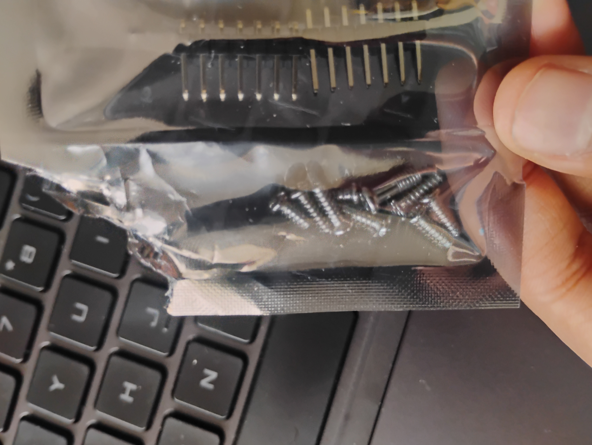

====================================
Lab 4: Motors and Open Loop Control
====================================

.. contents::
   :depth: 2
   :local:

Prelab
--------------------------------------------------------------------------
Here is a diagram of my wiring for lab 4. I used analog pins A2 and A3 for one motor driver and analog pins A4 and A5 for the motor driver on the Artemis board. The ground pins below A2 and A4 grounded the motor drivers.

.. image:: images/l4_diagram.png
   :align: center
   :width: 50%
   :alt: Wiring Diagram 

I powered the motordriver/motors and the Artemis from separate batteries because one battery does not provide enough current for both the Artemis and the motors/motor drivers.

Lab
--------------------------------------------------------------------------

Motor Driver Setup and Testing
^^^^^^^^^^^^^^^^^^^^^^^^^^^^^^^^^^^^^^^^^^

First thing I did was solder my motor controllers. I soldered them according to the wiring diagram above.  I couldn't take a super clean photo of a spread layout because I soldered some wires short (the motor connectors to the artemis, so it fits in the car properly). It was hard to make it all look nice and spreadout like the diagram I made. Since I was not happy with any photo particularly more than the rest, I attached all of them here.

.. list-table::
   :widths: auto
   :align: center

   * - .. image:: images/l4_pic_1.jpg
          :width: 100%
     - .. image:: images/l4_pic_2.jpg
          :width: 100%
     - .. image:: images/l4_pic_3.jpg
          :width: 100%

.. list-table::
   :widths: auto
   :align: center

   * - .. image:: images/l4_pic_5.jpg
          :width: 100%
     - .. image:: images/l4_pic_6.jpg
          :width: 100%
     - .. image:: images/l4_pic_7.jpg
          :width: 100%

After soldering, I took my Artemis with the motor controllers, and time of flight sensor(not currently used in this lab as of this task, but still soldered on) to go hook up to an oscilloscope.
I hooked it my wiring to an oscilloscope by probing the output pins of one motor driver. I then provided power with a power supply. I ran some code on my Artemis to produce PWM signals.

.. code-block:: cpp

   const int pwmPinA = 4;  
   const int pwmPinB = 3;  

   void setup() {
       // set outputs
       pinMode(pwmPinA, OUTPUT);
       pinMode(pwmPinB, OUTPUT);
   }

   void loop() {
       analogWrite(pwmPinA, 150); // this value was changed to generate different signals
       analogWrite(pwmPinB, 0);
   }

Here are the different signals I generated with different speeds set. The leftmost picture shows a PWM value of 50, the center picture shows 120, and the rightmost shows 250, respectively.

.. list-table::
   :widths: auto
   :align: center

   * - .. image:: images/l4_oscop1.jpg
          :width: 100%
          :alt: Oscope 1
     - .. image:: images/l4_oscop2.jpg
          :width: 100%
          :alt: Oscope 2
     - .. image:: images/l4_oscop3.jpg
          :width: 100%
          :alt: Oscope 3

Taking the Car Apart and Powering the Motors
^^^^^^^^^^^^^^^^^^^^^^^^^^^^^^^^^^^^^^^^^^
I took the car apart. Here is a photo of me saving the screws. I used an old open pouch for it.

Here is a video of me testing my motor controller/motor functionality before installing the car.

.. youtube:: FDdRFmgxxyc
   :width: 560
   :height: 315

Afterwards, I repeated this with the battery.

Installing the Car and Testing the Car
^^^^^^^^^^^^^^^^^^^^^^^^^^^^^^^^^^^^^^^^^^

I then put the car back together and soldered the motor drivers to the motors appropriately. Here is a picture.

.. image:: images/l4_car_pic.png
   :align: center
   :width: 50%
   :alt: Car Anatomy pic

Then I played with the lower limit of the PWM value. After trial and error. I got 40 for the the car barely moving if it goes straight and 42 if you want to see it clearly. I got 90 for turning if you want to see the wheels barely move. 

Here is a video of the car clearly moving straight at the lower limit(42)

.. youtube:: oQpkeGmDyzs
   :width: 560
   :height: 315

Here is a video of the car barely turning(90)

.. youtube:: zbOJk1BE8QA
   :width: 560
   :height: 315

Here is a video of it moving in a straight line. I added in a calibration factor of 1.1. I initally used 1.2 and it completed reflected the angle, so I changed it to 1.1(average of 1 and 1.2) and it was perfect. 

Here is what my video looked like without calibration.

 .. youtube::  pMdI8lJnH2M
          :width: 560
          :height: 315

And here it is with calibration. 

 .. youtube:: PyMHi1nQnH8
          :width: 560
          :height: 315

Here is my open loop video.  I just made it go straight, delayed it, stopped it, delayed it, and then made it turn and delayed it. I put it in a loop.

.. youtube:: jN_8m0IKsdo
   :width: 560
   :height: 315

Reflection
-----------------------------
My soldering skills definitely improved. As did my oscilloscoping skills. Fun Fact: I broke multiple oscilloscopes when I took ECE 2100. You might be thinking? How do you even do that? Professor Clifford Pollack told me I was impressive. The answer is I don't know. Anways I am happy to report no oscilloscopes were harmed during this lab! Yay!!!! Improvement. The code was overall not difficult for me. This lab was fun.

Acknowledgements
-----------------------------
Thank you to Anunth Ramaswami for sitting with me while I soldered and for bringing me a power supply for when I tested powering my motors and letting me use your lab to save walking time. Thank you to Aravind Ramaswami for bringing the power supply for when I was using the oscillosope, letting me use your lab to save walking time, and also filming my straight line video so I could align my car on the line properly. Thank you to Sabian Grier, Becky Lee, Aidan McNay, Paige Shelton, and Annabel Lian for hyping me up and making sure I ate enough food to fuel me through working on this lab. I used ChatGPT to help figure grid images and edit my conf.py file in regards to my website. Turns out videos were not appearing because I did not edit my extensions.
