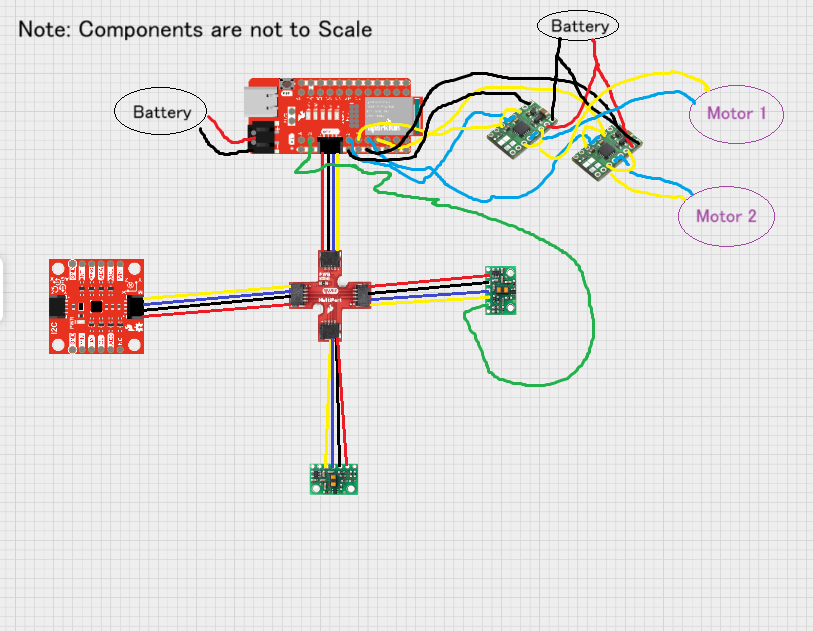
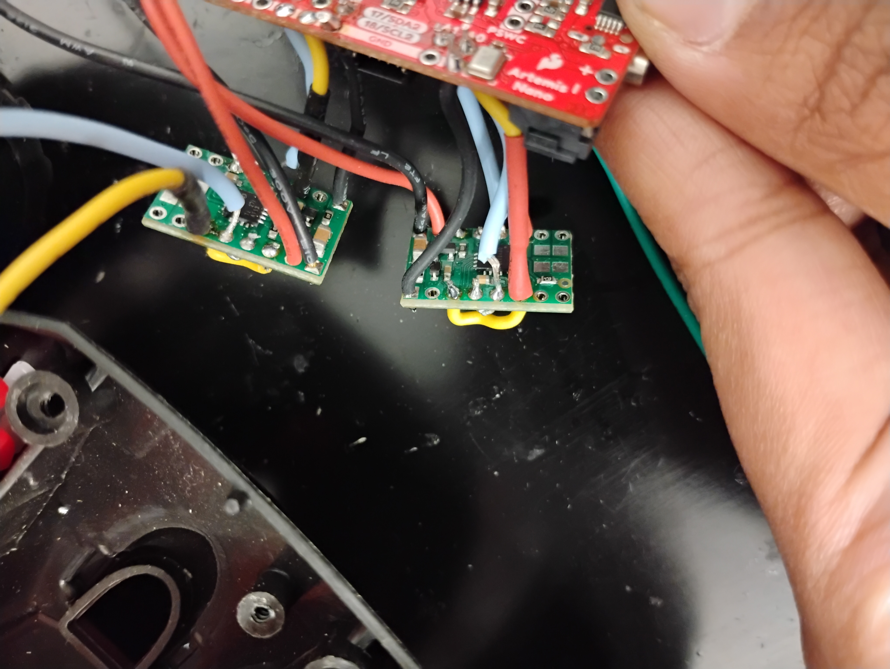
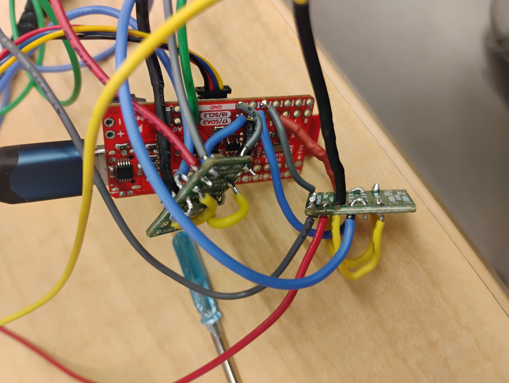
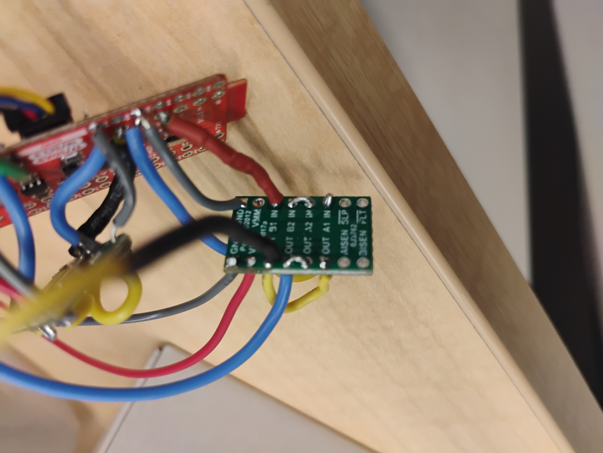
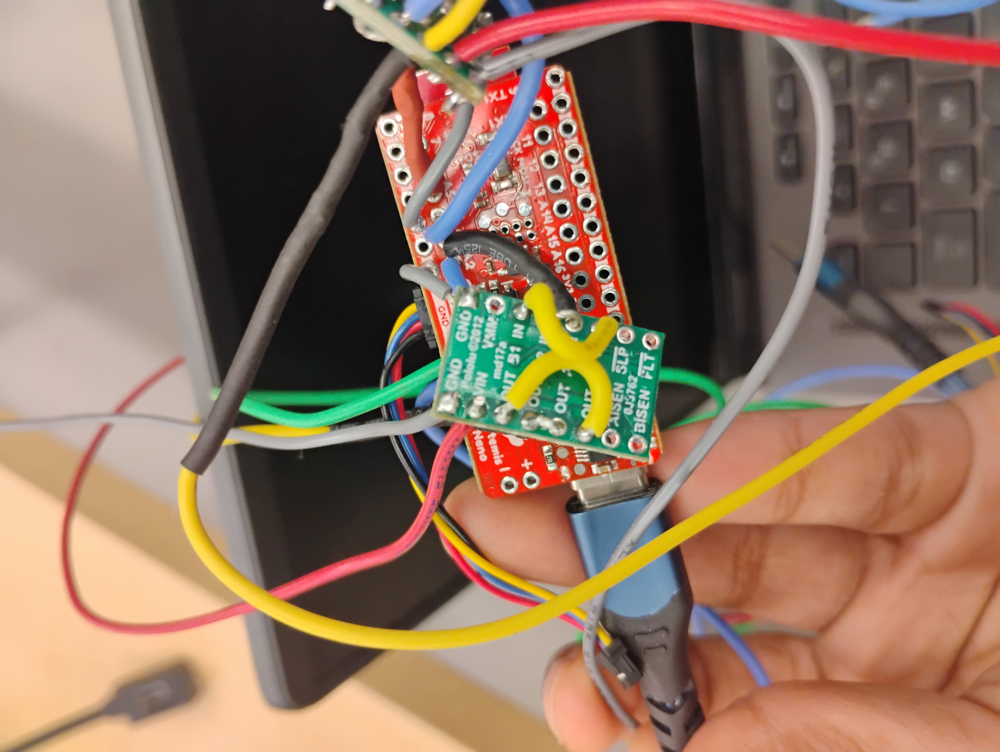
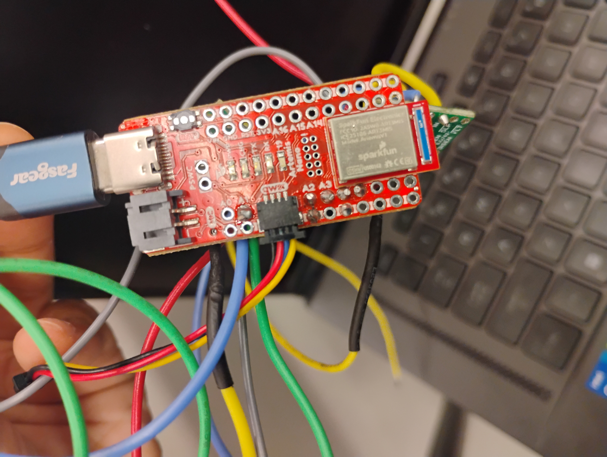
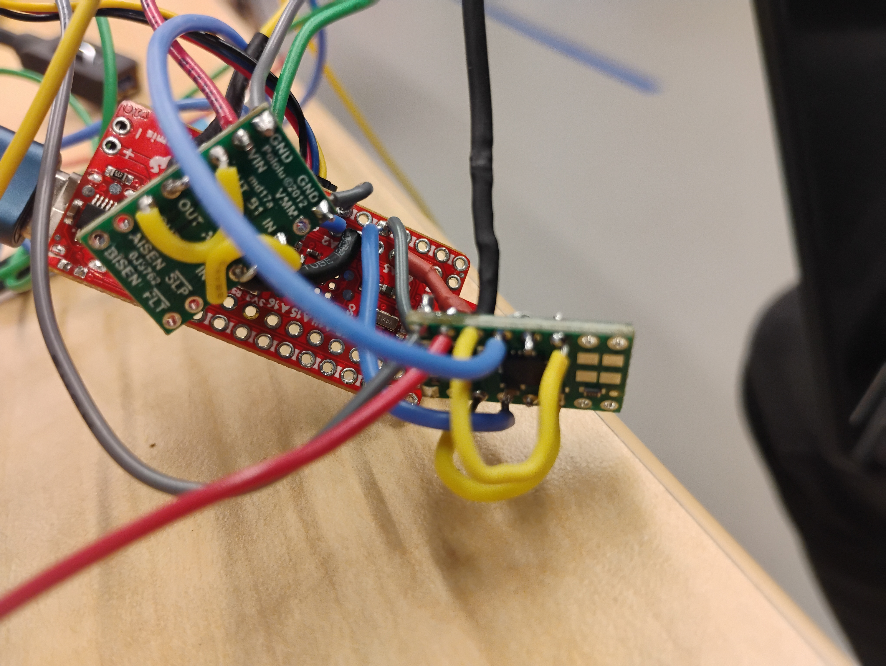
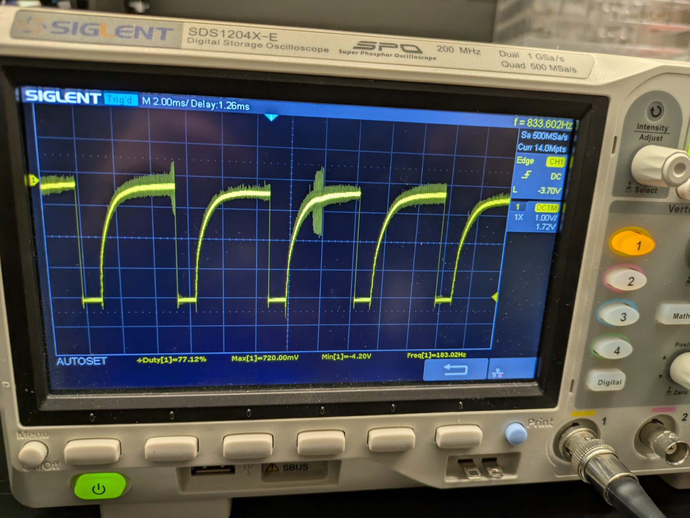
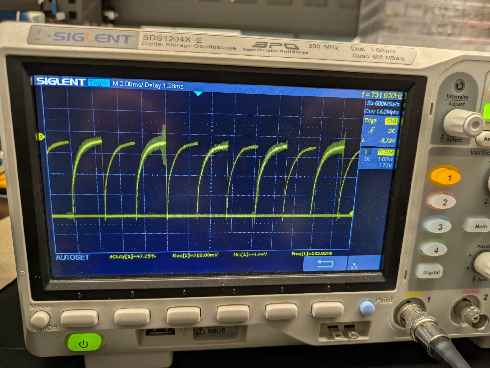
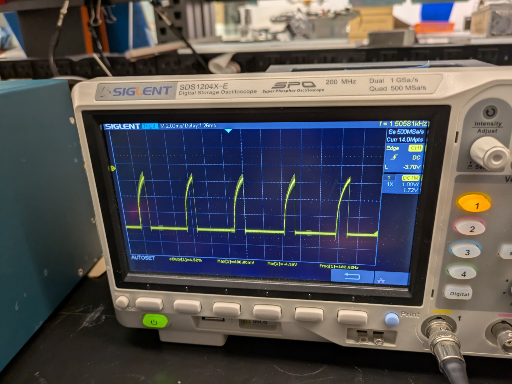

====================================
Lab 4: Motors and Open Loop Control
====================================

.. contents::
   :depth: 2
   :local:

Prelab
--------------------------------------------------------------------------
Here is a diagram of my wiring for lab 4. I used analog pins A2 and A3 for one motor driver and analog pins A4 and A5 for the motor driver on the Artemis board. The ground pins below A2 and A4 grounded the motor drivers.

I powered the motordriver/motors and the Artemis from separate batteries because one battery does not provide enough current for both the Artemis and the motors/motor drivers.

Lab
--------------------------------------------------------------------------

Motor Driver Setup and Testing
^^^^^^^^^^^^^^^^^^^^^^^^^^^^^^^^^^^^^^^^^^

First thing I did was solder my motor controllers. I soldered them according to the wiring diagram above. The following pictures are all photos of what I did 

.. list-table:: 

    * - .. figure:: images/l4_pic_1.jpg

           Pic 1

      - .. figure:: images/l4_pic_1.jpg

            Pic 2
    * - .. figure:: images/l4_pic_3.jpg

           pic 3

Taking the Car Apart
^^^^^^^^^^^^^^^^^^^^^^^^^^^^^^^^^^^^^^^^^^

Power the Motors
^^^^^^^^^^^^^^^^^^^^^^^^^^^^^^^^^^^^^^^^^^

Installing the Car
^^^^^^^^^^^^^^^^^^^^^^^^^^^^^^^^^^^^^^^^^^

Testing the Car
^^^^^^^^^^^^^^^^^^^^^^^^^^^^^^^^^^^^^^^^^^

Reflection
-----------------------------

Acknowledgements
-----------------------------
