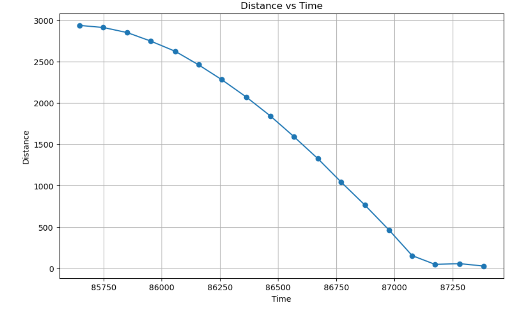
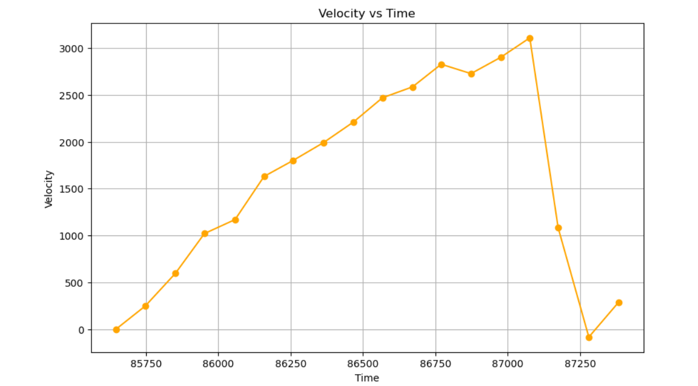
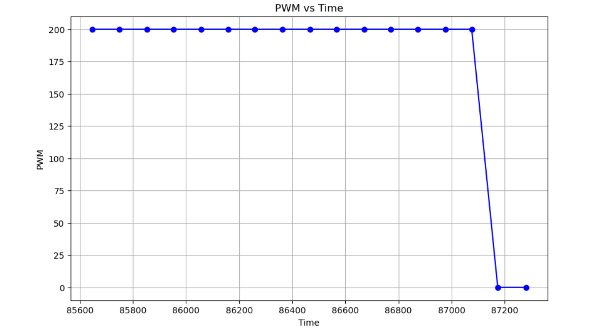
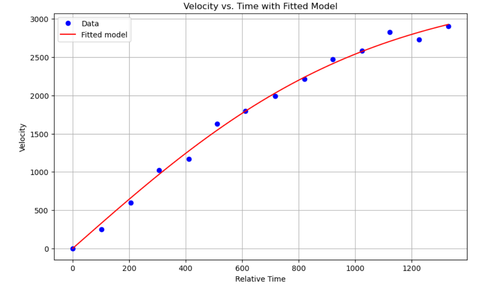
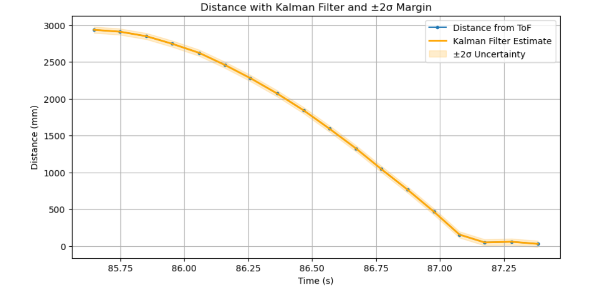
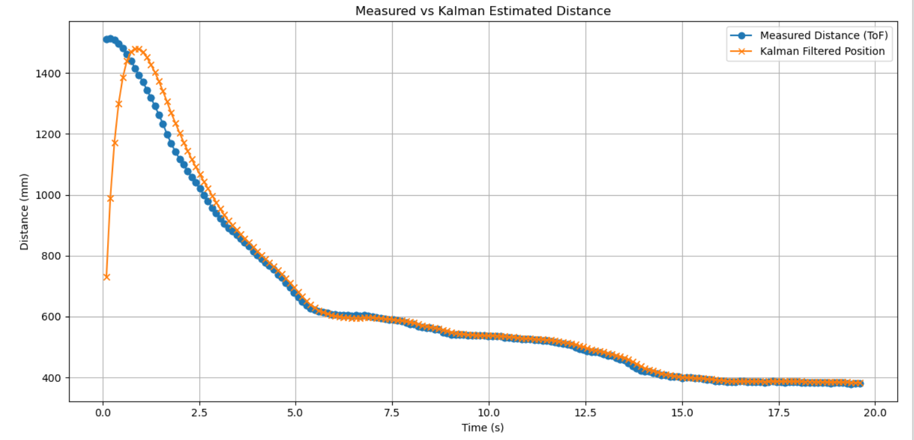
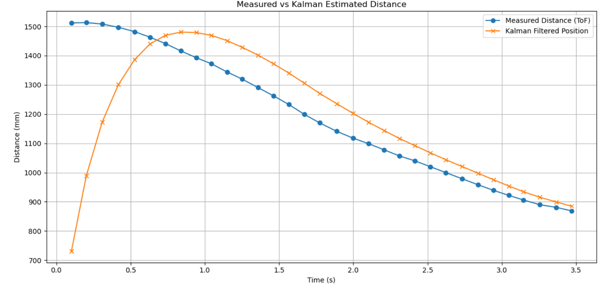

====================================
Lab 7: Kalman Filter
====================================

.. contents::
   :depth: 2
   :local:

Lab
--------------------------------------------------------------------------

Estimating Drag and Momentum
^^^^^^^^^^^^^^^^^^^^^^^^^^^^^^^^^^^^^^^^^^

I applied a constant PWM signal of 200 and recorded the TOF sensor data to estimate steady-state speed and rise time. I then fit an exponential model to the velocity curve to extract the drag coefficient and effective mass. I planed the car around 3 m away from a wall.

Here are the plots of distance, computed velocity, and PWM:

Steady-state velocity: **3110 mm/s**  
Rise time (90%): ** 1.123 s**  
Velocity at 90% rise time: **2799 mm/s**

Drag to Mass Coefficient Ratio: ** 2.9×10 −7**

Kalman Filter Initialization (Python)
^^^^^^^^^^^^^^^^^^^^^^^^^^^^^^^^^^^^^^^^^^

I used the discretized state-space model as follows:

.. code-block:: python

  code

My initial state vector and covariances:

.. code-block:: python

  code

Implementing and Testing KF in Jupyter
^^^^^^^^^^^^^^^^^^^^^^^^^^^^^^^^^^^^^^^^^^

I processed the collected lab data through the Kalman Filter, adjusting the process and sensor noise to improve accuracy.

I had to adjust Q and R when tuning. Q represents process noise covariance, which essentially models uncertainty in the dynamics of the system like disturbances or forces that are not modeled. A larger Q assumes the model is less reliable and therefore trusts the measurements more. Because of this it is particularly sensitive to changes in measurements, which can have noise. On the other hand, a smaller Q puts more confidence in the model and makes the estimates smoother. However it may lag behind if the model is not accurate enough. R represents the measurement noise covaraince and it models how noisy or uncertain the sensor readingsg are. When R is larger, it means the filter thinks the measurements are noisy so it relies on the model and tries to smooth our any fluxuations in the measurement. Smaller R values cause the filter ot respond with aggression in response to measurement updates but as it becomes more responsive, it is more sensitive to noise. I needed to balance Q and R to tune my filter

Here's my KF code in Python:

.. code-block:: python

 coe

I initially had issues with my covariance matrices, but that was because I was calculating them wrong. 

Kalman Filter on the Robot
^^^^^^^^^^^^^^^^^^^^^^^^^^^^^^^^^^^^^^^^^^

I implemented the Kalman Filter on the Artemis using the `BasicLinearAlgebra` library. I updated my `run_pid_step` function from Lab 5 to integrate the filtered distance into PID control.

Here is a video of the robot stopping smoothly with the Kalman Filter:

.. youtube:: xktYL56z2E4
   :width: 560
   :height: 315

Here is a plot of raw vs filtered sensor data:

And here is a zoomed-in version:

To implement the kalman filter within my pid loop, I wrote a function update_kalman which I called within my PID loop.

Reflection
-----------------------------
This lab was pretty fun. There were times when my kalman filter was broken and I did not know what I was doing wrong, but I figured it out. Kalman filters are cool. I thought my robot was broken during lab 6, but it started functioning again. I think my battery had died during lab 6 because everything seemed to work this time.

Acknowledgements
-----------------------------
Thank you to the course staff for their help and my fellow classmates for using ed discussion. It has been very helpful.
I used ChatGPT to help debug code and also create a barebones outline of this report before filling in all the details(it created the headers). It also helped debug my plots.
