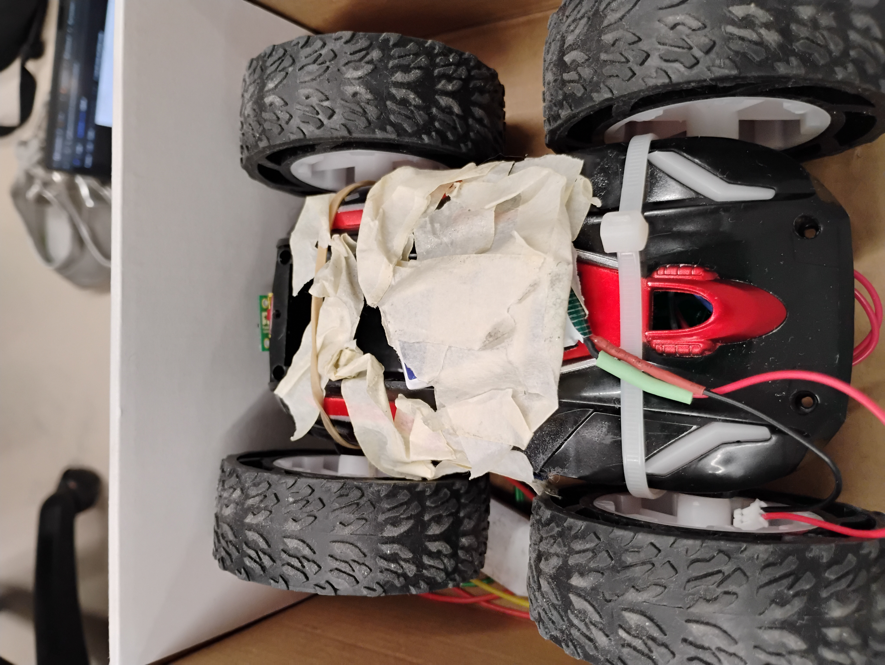
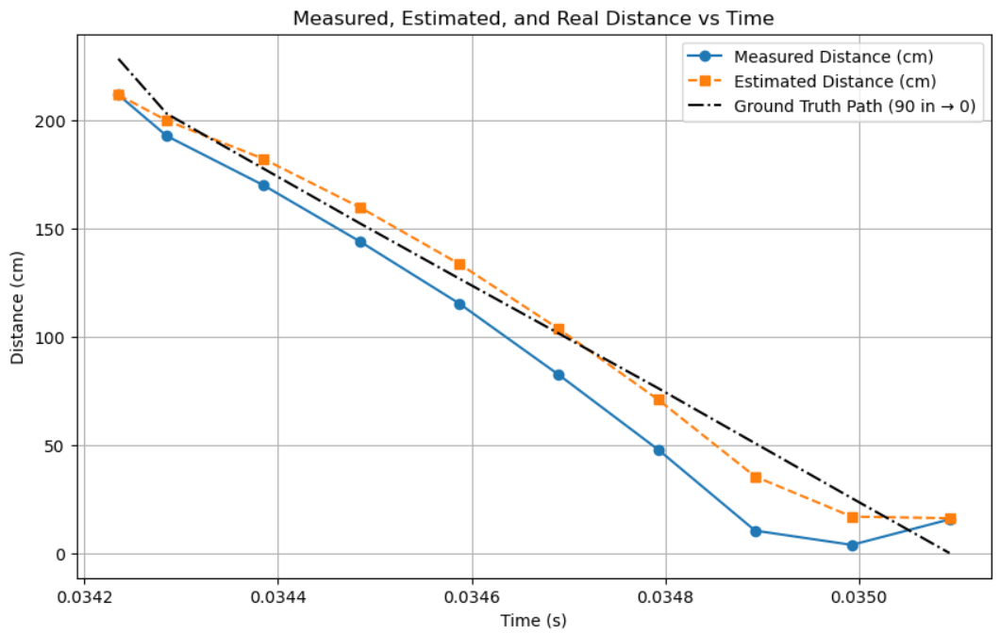
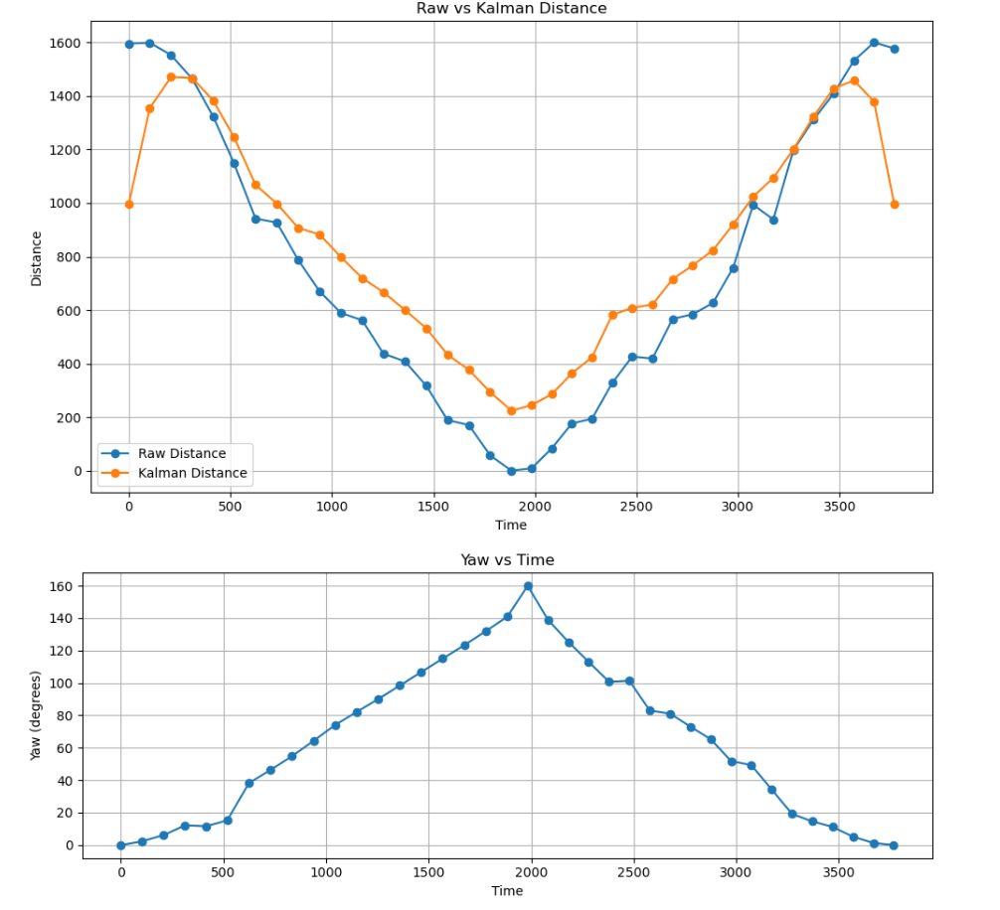
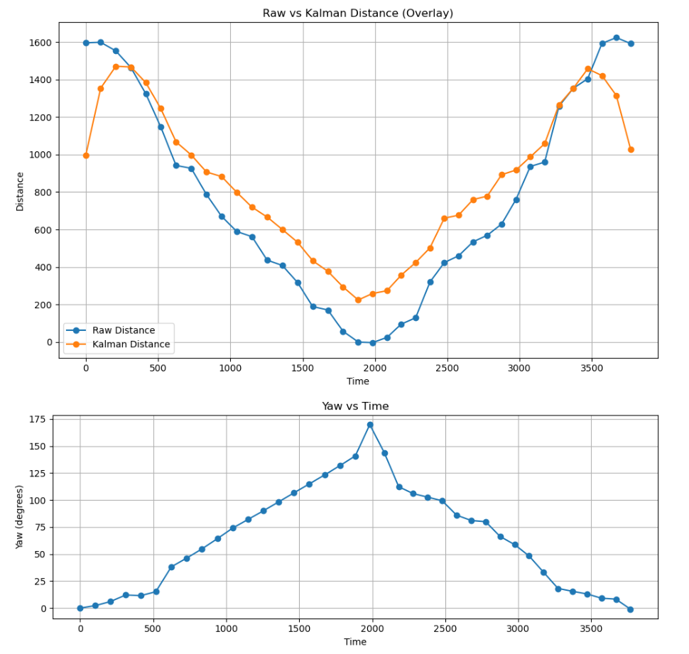
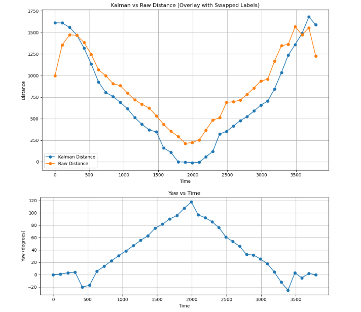
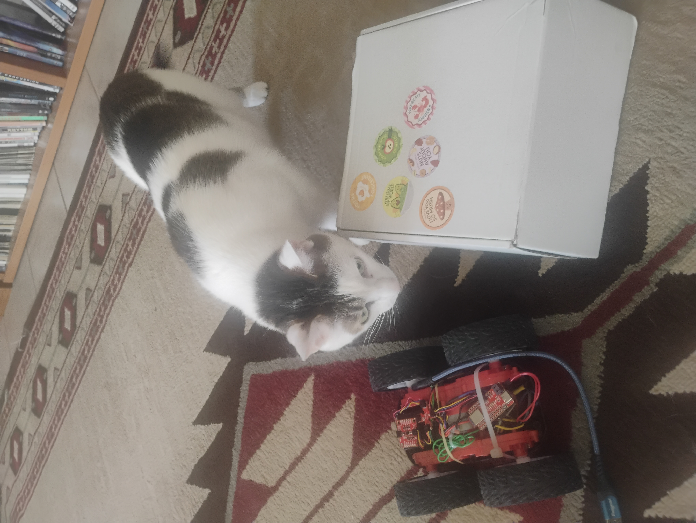

Lab 8: Stunts!
====================================

.. contents::
   :depth: 2
   :local:

Objective
-----------------------------
The objective of this lab was to execute a high-speed robot stunt that combined different ideas that we have learned about in Fast Robots and I am happy to report that it was a fun successful lab.

I chose to execute the drift task(Task B), but I initially wanted to do the flip, so I had reinforced my car with tape particularly to reinforce the batteries. This meant it was also prepared for drifting. Here is a photo.

Setup and Preparation
-----------------------------

Before attempting the stunt, I ensured all components were working properly — including the Artemis board, TOF sensors, IMU, and motor drivers. I also reviewed and tested my Kalman Filter and PID code from previous labs.

I modified my Kalman Filter code from Lab 7 to gather data on my car while using a PWM signal of 250. In Lab 7 I had used a lower PWM signal, so I wanted to understand how my robot behaved at higher speeds approaching a wall. Below is the data I collected. I did NOT tune my filter very well. I am disclosing this honestly, but at the end of the day my code still excuted and it still used this kalman filter so, I am showing the work I did for this lab on my website. 

Stunt Execution: Task B - Drift
-----------------------------

I had the robot start away from the wall, and I tuned the drift trigger point based on TOF/KF estimation to begin the 180-degree turn approximately 914mm (3 floor tiles) from the wall.

Here are three successful runs:

.. youtube::  Ki0Dn_ntjnI
   :width: 560
   :height: 315

.. youtube:: OwwN-latBQM
   :width: 560
   :height: 315

.. youtube:: CPaaE2tsfK8
   :width: 560
   :height: 315

They took 8 seconds, 10 seconds, and 9 seconds respectively. There seemed to be a flaw where the car stopped and paused even though I did not use any delays in my code. There was a bug where my code seemed to reset when my car stopped and just not append data. Here are the plots of collected data regardless. Note: my kalman filter was not tuned very well. Also, my plots looked a little weird. I did some investigating and also asked a TA, but we couldn't seem to diagnose the issue of why they looked so funky.

Tuning and Control Strategy
-----------------------------

To make the stunt successful, I used the Kalman Filter to estimate when the robot was within 914mm of the wall, then initiated the 180-degree spin. I used two functions START_DRIFT and STOP_DRIFT.Here are snippets of the code.

Here is how I implemented a Kalman filter. I initialied the matrices and wrote an update Kalman function.

.. code-block:: cpp
   :caption: Kalman Filter Code

       // Kalman Filter
         Matrix<2> x = {0, 0}; 
         Matrix<2, 2> P = {1000, 0, 0, 1000};
         Matrix<2, 2> Q = {1000, 0, 0, 10};
         Matrix<2, 2> R = {1200, 0, 0, 250};
         Matrix<2, 2> H = {1, 0, 0, 1};
         
         float m = 3.0;
         float dt = 0.1;
         Matrix<2,2> A;
         Matrix<2,1> B;
         
         
         void update_kalman(float dist, float pwm_input, float dt) {  
           Matrix<2, 2> A = {1, dt, 0, 1 - dt/m};
           Matrix<2, 1> B = {0, dt/m};
         
           Matrix<1> u = {pwm_input};
           Matrix<2> x_pred = A * x + B * u;
           Matrix<2,2> P_pred = A * P * ~A + Q;
         
           Matrix<2> z = {dist, 0}; // velocity unused here
           Matrix<2> y = z - H * x_pred;
           Matrix<2,2> S = H * P_pred * ~H + R;
           Invert(S);
           Matrix<2,2> K = P_pred * ~H * S;
         
           x = x_pred + K * y;
           Matrix<2,2> I = {1, 0, 0, 1};
           P = (I - K * H) * P_pred;
         }

I wrote two commands: START_DRIFT AND STOP_DRIFT. Here is START_DRIFT. They both mainly handled flags that void loop() used later to figure out what to do.

.. code-block:: cpp
   :caption: START_DRIFT

      case START_DRIFT:
         Serial.println("START_DRIFT received.");
         drifting = true;
         drift_triggered = false;
         drift_complete = false;
         log_index = 0;
         last_sample_time = millis();
         x = {0, 0};
         P = {1000, 0, 0, 1000};
         break;

Here is a chunk of code I wrote in void loop for handling functions.

.. code-block:: cpp
   :caption: a chunk of loop code

         if (drifting  && log_index < MAX_SAMPLES) {
           unsigned long now = millis();
           if (now - last_sample_time >= dt * 1000) {
             last_sample_time = now;
   
             distanceSensor.startRanging();
             while (!distanceSensor.checkForDataReady()) delay(1);
             int dist = distanceSensor.getDistance();
             distanceSensor.clearInterrupt();
             distanceSensor.stopRanging();
   
             imu.getAGMT();
             float gyro_z = imu.gyrZ();
   
             update_kalman(dist, FORWARD_PWM, dt);
   
             time_log[log_index] = now;
             dist_log[log_index] = dist;
             gyro_log[log_index] = gyro_z;
             kalman_dist_log[log_index] = x(0);
             kalman_vel_log[log_index] = x(1);
             pwm_log[log_index] = drift_triggered ? TURN_PWM : FORWARD_PWM;
             log_index++;
   
             if (!drift_triggered && dist < DRIFT_THRESHOLD) {
               drift_triggered = true;
               Serial.println("Drift initiated.");
               drift_turn();
             }
   
             if (drift_triggered && abs(gyro_z) > FLIP_THRESHOLD_DPS) {
               drift_complete = true;
               drifting = false;
               stop_motors();
               Serial.println("Drift complete.");
               send_drift_data();
             }
   
             if (!drift_triggered) move_forward();
           }
   
         }

This is how I sent data. I wrote a function for it.

.. code-block:: cpp
   :caption: Sending data

       void send_drift_data() {
           for (int i = 0; i < log_index; i++) {
             tx_string.clear();
             tx_string.append(time_log[i]); tx_string.append("|");
             tx_string.append(dist_log[i]); tx_string.append("|");
             tx_string.append(gyro_log[i]); tx_string.append("|");
             tx_string.append(kalman_dist_log[i]); tx_string.append("|");
             tx_string.append(kalman_vel_log[i]); tx_string.append("|");
             tx_string.append(pwm_log[i]);
             tx_characteristic_string.writeValue(tx_string.c_str());
             delay(30);
           }
           Serial.println("Drift data sent.");
         }

Reflection
-----------------------------

Acknowledgements
-----------------------------

Thanks to the friends who let me take over their hallway and crash mats.  
Shoutout to Glue, the best cat - didn't quite make it into the blooper reel, but we still love him.  
And thank you to the course staff for your help. I looked at Stephan Wagner and Daria Kot's websites for references on how they graphed their data.
Also, thanks to ChatGPT for helping me debug C code and for catching syntax errors in my write-up. You over edited and started changing my text and I had to revert. 

