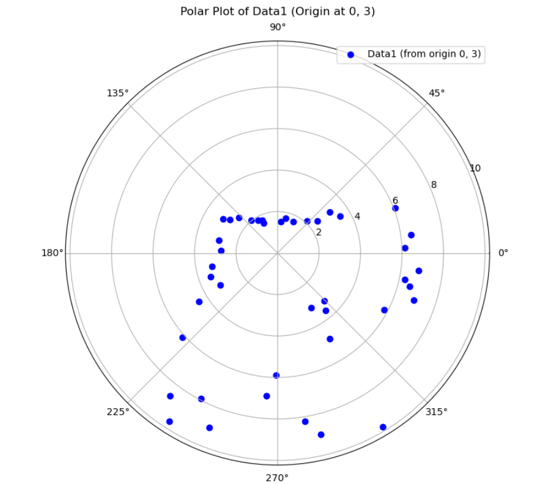
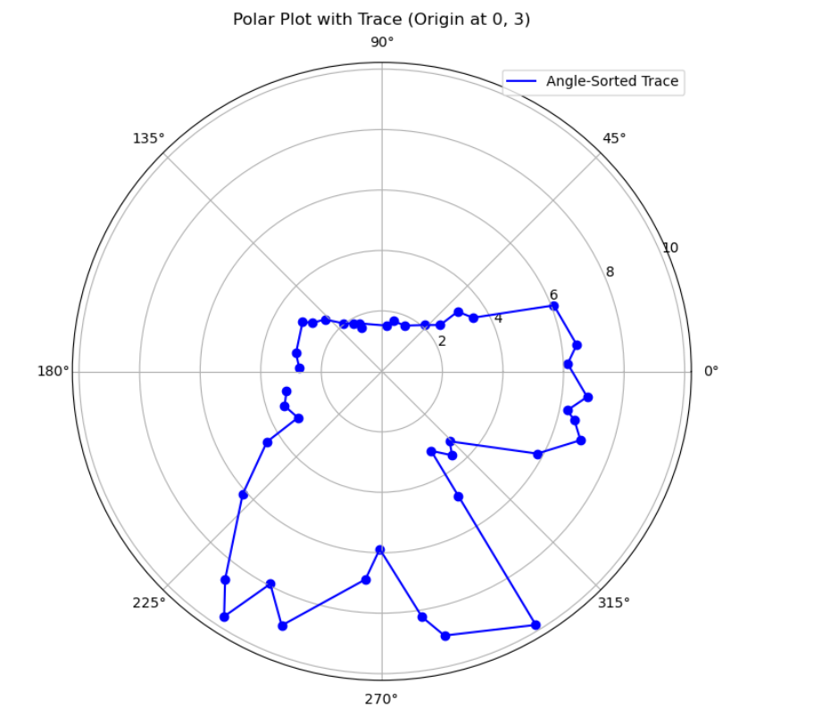
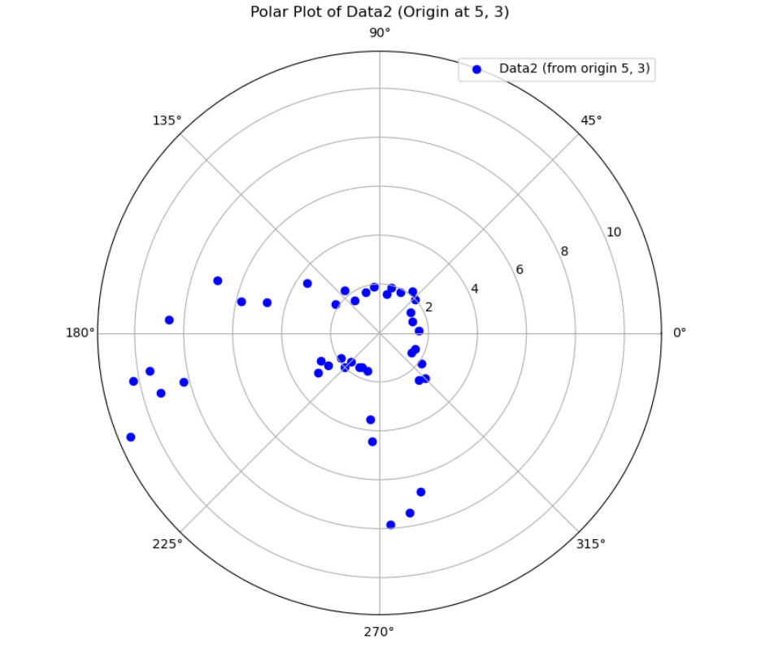
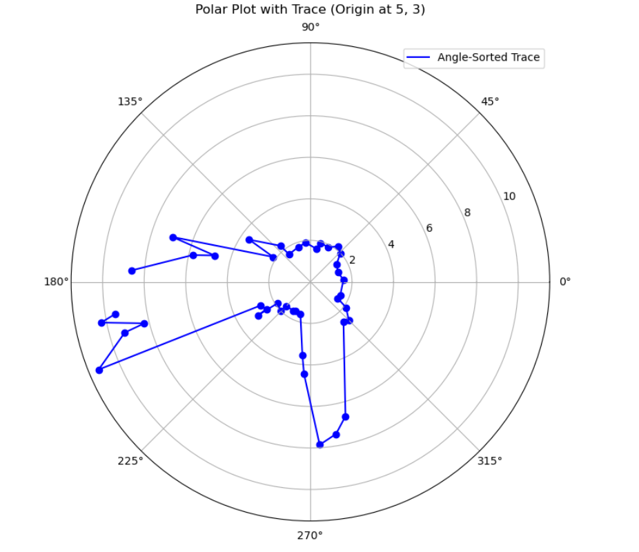
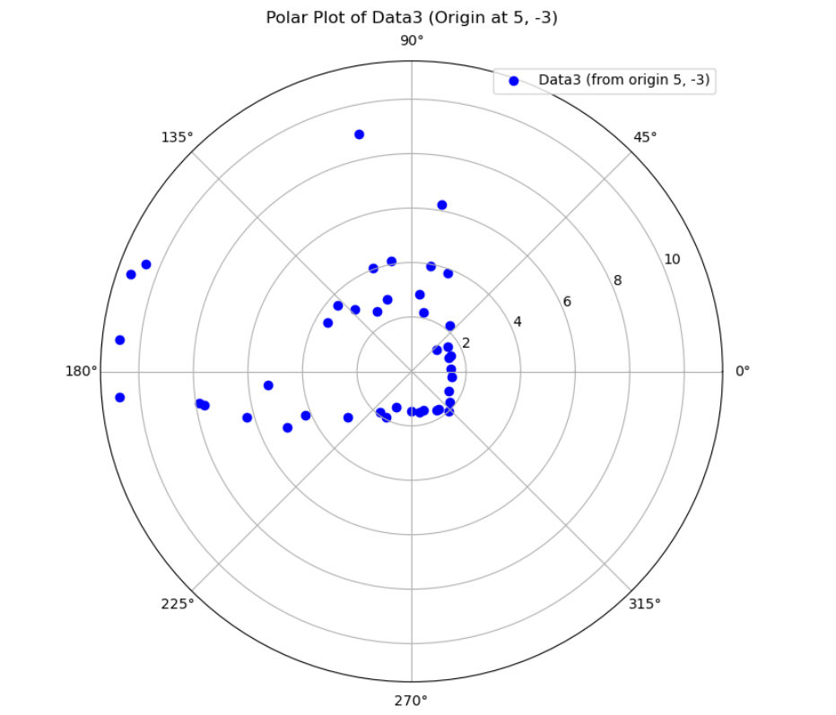
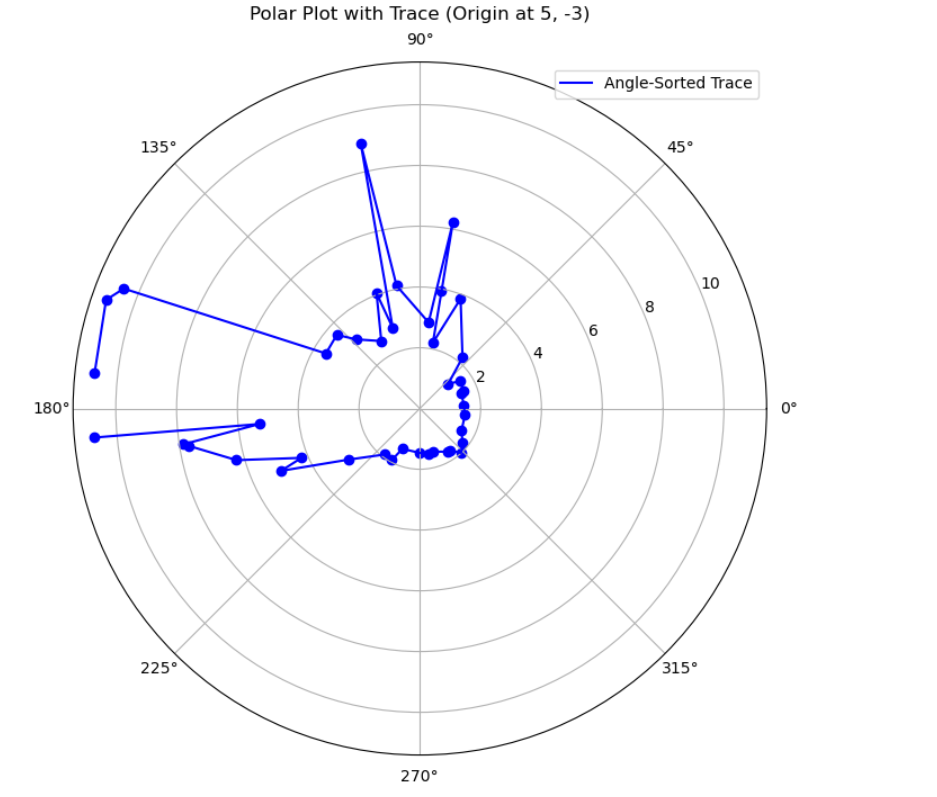
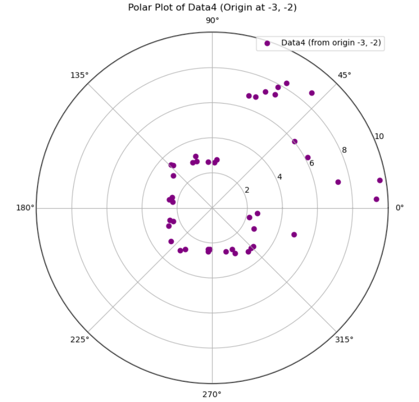
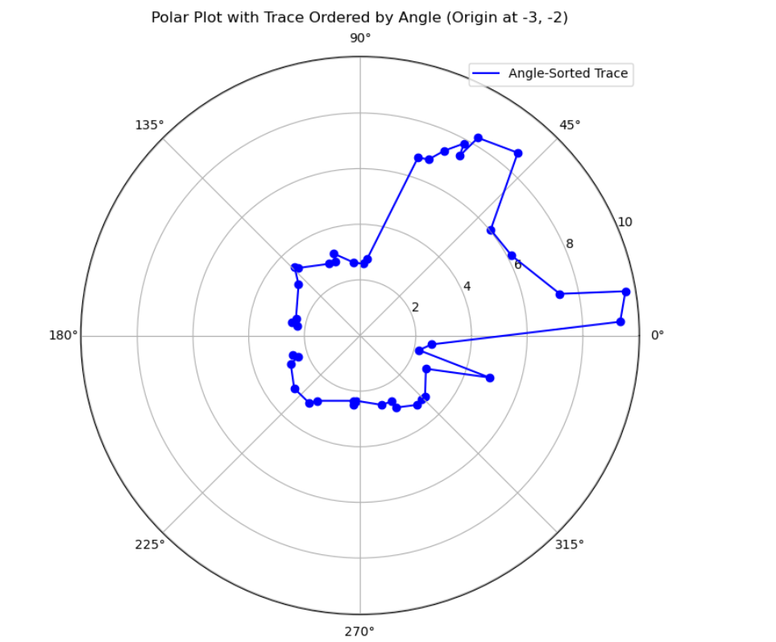
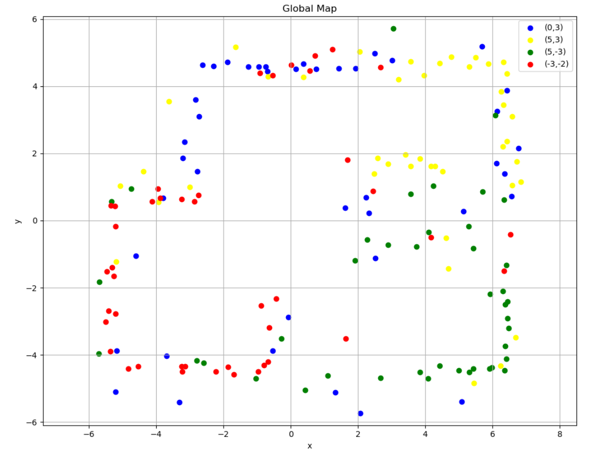
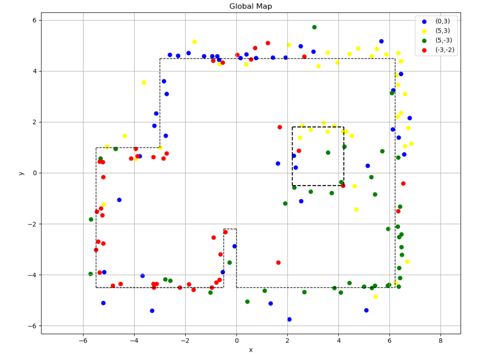

Lab 9: Mapping
====================================

.. contents::
   :depth: 2
   :local:

Overview
-----------------------------

This lab focuses on mapping a static environment by taking our robots and performing a 360° in-place rotation and collecting data from our time-of-flight (ToF) sensors. 
I used the orientation-based PID control approach via DMP yaw estimates from the ICM-20948 IMU with PID tuning.

At each angular increment(for this lab it was 25°), the robot paused and collected several ToF readings. These readings were collected with timestamp and heading. After completing the scan, the data is transmitted over BLE for post-processing into a global map.

Control Strategy and Angle Wrapping
---------------------------------------------

To perform accurate rotations, the robot uses a PID loop around the DMP-derived yaw. The yaw is calculated from quaternions:

.. code-block:: c

   double siny = 2.0 * (qw * qz + qx * qy);
   double cosy = 1.0 - 2.0 * (qy * qy + qz * qz);
   yaw_out = atan2(siny, cosy) * 180.0 / PI;

To ensure the yaw does not wrap unexpectedly at ±180°, the PID loop applies this correction:

.. code-block:: c

   if (yaw_error > 180) yaw_error -= 360;
   if (yaw_error < -180) yaw_error += 360;

This guaranteed smooth control and allows the robot to turn reliably to target angles.

Dynamic PID Tuning
-----------------------------

PID gains are adjusted dynamically based on yaw error:

.. code-block:: c

   float abs_err = abs(error);
   Kp = 0.3 * abs_err;
   if (Kp > 0.12) Kp = 0.12;

This approach avoided overshooting at small errors and ensured faster convergence at larger angles.

Command Handling
---------------------------------------------

The robot responds to BLE commands via a `handleCommand()` function that supports:

- `DO_MAPPING` – perform a full 360° scan, collecting `readings_per_angle` samples at each `increment_deg`(I used 25 degrees for this lab as the instructions said so)
- `POINT_TO_ANGLE` – rotate to a specified angle ( redoing lab 6 if you will)
- `STOP` – interrupt ongoing behavior. (Sometimes when tuning, I really needed to stop, but also still exampline data).

For mapping, the following loop is executed:

.. code-block:: c

   for (int angle = 0; angle < 360; angle += increment_deg) {
     yaw_target = angle;
     while (millis() - start_time < 5000) {
       pidYawControl(yaw_target);
       if (abs(yaw_error) <= err_thresh) break;
     }
     stopMotors();
     delay(200);
     for (int i = 0; i < readings_per_angle; i++) {
       tof.startRanging();
       delay(70);
       readDMPYaw(yaw);
       recordReading();
     }
   }

Measurement Logging
-----------------------------

Each reading consists of:

- Timestamp (miliseconds)
- Unwrapped yaw angle (in degrees)
- ToF distance (in mm)

These are stored in arrays:

.. code-block:: c

   yaw_log[log_index] = yaw;
   tof_log[log_index] = dist;
   time_log[log_index] = millis();

After the full scan, readings are sent back over BLE:

.. code-block:: c

   tx_string.clear();
   tx_string.append(time_log[i]); tx_string.append("|");
   tx_string.append(yaw_log[i]); tx_string.append("|");
   tx_string.append(tof_log[i]);
   tx_characteristic_string.writeValue(tx_string.c_str());

Robot Video
-----------------------------
Here is a video of the pid loop running with the data collection.

.. youtube:: uPCNITwPCb0
   :width: 560
   :height: 315

Post-Processing
-----------------------------

On the Python side, each BLE message is parsed into:

.. code-block:: python

   time = float(data_components[0]) / 1000
   yaw = float(data_components[1]) * np.pi / 180
   distance = float(data_components[2]) / 1000

Each point is translated into global coordinates from a known pose:

.. math::

   x = x_0 + r \cos(\theta) \\
   y = y_0 - r \sin(\theta)

Polar and Cartesian plots are generated to verify individual scans.

Here is the individual plots for (0,3)

Here is the individual plot for (5,3)

Here is the individual plot for (5,-3)

Here is the individual plot for (-3,2)

If you make plots that are scaled the same and place them on the map at their location, you can make a global map. See below.

Global Mapping
-----------------------------

The robot is placed at 4 distinct positions `(-3, -2)`, `(0, 3)`, `(5, -3)`, `(5, 3)`), and performs a full 360° scan at each. These are combined into a merged global map:

Here is the image with the lines drawn on top 

Here are the segments in list form. They can be used next lab.

List 1

.. code-block:: c

   (-3, 4.5) → (6.2, 4.5)
   (-3, 4.5) → (-3, 1)
   (6.2, 4.5) → (6.2, -4.5)
   (0, -4.5) → (6.2, -4.5)
   (0, -4.5) → (0, -2.2)
   (-5.5, -4.5) → (-5.5, 1)
   (-5.5, -4.5) → (-0.5, -4.5)
   (-0.5, -4.5) → (-0.5, -2.2)
   (-5.5, -4.5) → (-0.5, -4.5)
   (-0.5, -2.2) → (0, -2.2)
   (-5.5, 1) → (-3, 1)

List 2

.. code-block:: c

   (2.2, -0.5) → (4.2, -0.5)
   (2.2, 1.8) → (4.2, 1.8)
   (2.2, -0.5) → (2.2, 1.8)
   (4.2, -0.5) → (4.2, 1.8)

Reflection
-----------------------------

I decided to use the DMP for this lab as I did not for lab 6 and getting it working and in a way redoing lab 6 was the hardest part. It was very rewarding once complete though.

Acknowledgements
-----------------------------

Thanks to the course staff for feedback on motor tuning.  Special thanks to Anunth Ramaswami for letting me film a video on his robot after I broke one of my motor drivers(I had to adjust my constant values). Thanks to Anunth Ramaswami, Aravind Ramaswami, and Aidan McNay for answering my random questions about the DMP. Chat GPT was used to generate a barebones template for this write up as usual, plot points, and also help debug my code sometimes

